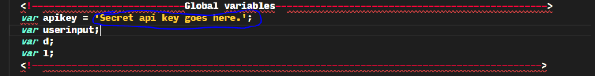
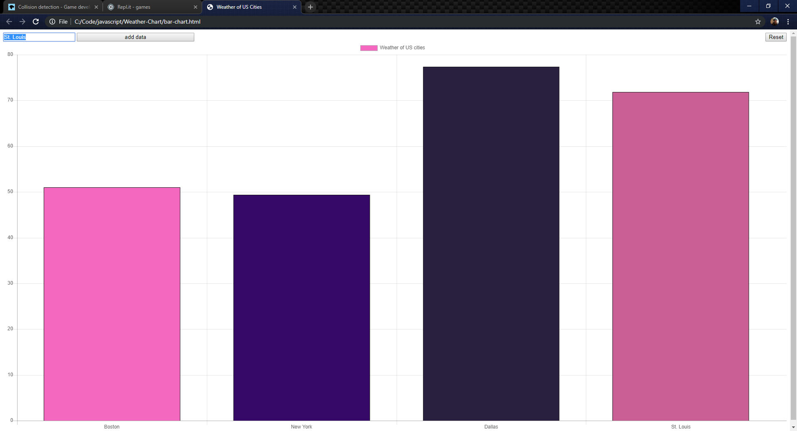

# US cities bar chart generator

This program uses the **Open Weather** api for the weather data, **chart.js** to create the bar graph, and **JQuery** with **ajax** to make the api calls.

## configuration

In order to get this program to function you must go to [OpenWeather](https://openweathermap.org/api) and register for an api key which is free. Once you register add your api key to the apikey variable under global variables. Then it should be fully configured. 

## A preview of the working program
